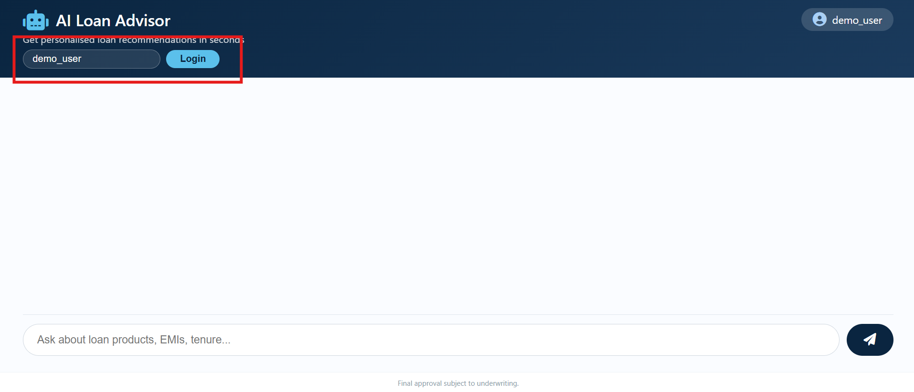
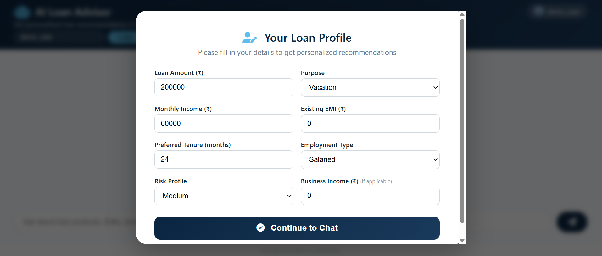
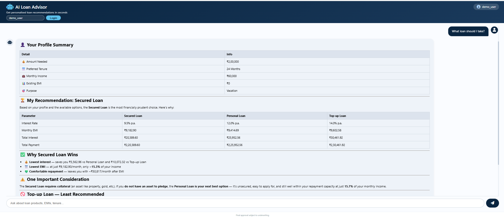
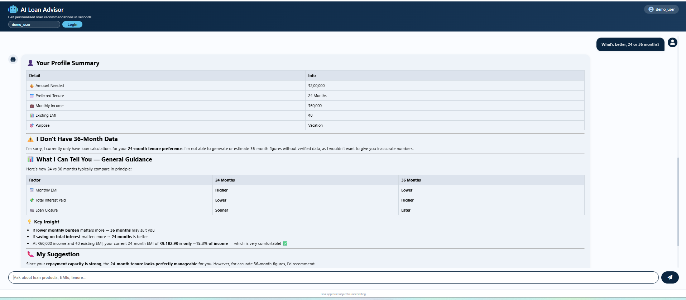
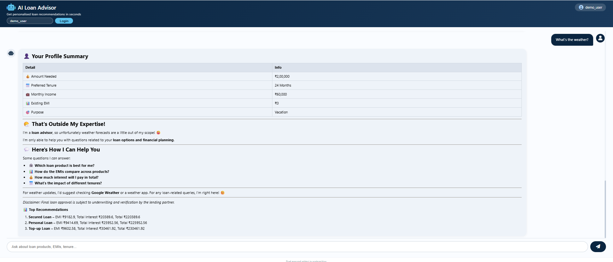

# AI Loan Advisor Chatbot

A conversational assistant that helps users compare loan products, understand EMI and total cost, and receive personalized, responsible recommendations.

---

## Features

- **Product catalogue** – 6 mock loan products (Personal Loan, Salary Advance, BNPL, SME Loan, Top‑up, Secured Loan).
- **Eligibility engine** – checks amount, tenure, income, existing EMI, purpose, employment type, and risk profile.
- **EMI calculator** – computes monthly instalment, total interest, and total repayment.
- **Recommendation scoring** – ranks products based on affordability, cost, and purpose match.
- **Conversational UI** – modern, full‑screen chat interface with avatars and Markdown rendering.
- **User authentication** – mock JWT login; each user gets isolated profile and chat history.
- **Chat memory** – last 3 exchanges are included as context for follow‑up questions.
- **Responsible AI** – every response is grounded in real calculations; the LLM never invents numbers.
- **Disclaimer** – every answer reminds the user that final approval is subject to underwriting.

---

## Tech Stack

| Layer | Technology |
|-------|------------|
| Backend | FastAPI (Python) |
| Frontend | HTML + CSS + Vanilla JS |
| AI | External LLM Wrapper (provided) |
| Authentication | JWT (mocked) |
| Environment | Python virtual environment with `.env` |

---

## Setup & Run

### 1. Clone the repository

```bash
git clone https://github.com/VikashkrVerma/loan-advisor-chatbot.git
cd loan-advisor-chatbot
```

### 2. Create and activate virtual environment

```bash
python -m venv venv
venv\Scripts\activate
```

### 3. Install dependencies

```bash
cd backend
pip install -r requirements.txt
```

### 4. Configure environment variables

Create a `.env` file inside the `backend/` folder with:

```env
LLM_WRAPPER_URL=https://llm-wrapper-741152993481.asia-south1.run.app/llm/query
LLM_API_TOKEN=your_actual_token_here
SECRET_KEY=your-secret-key
DEBUG=True
```

Replace `your_actual_token_here` with the token provided for the LLM wrapper.

### 5. Run the server

From the project root:

```bash
uvicorn backend.app:app --reload --host 0.0.0.0 --port 5000
```

### 6. Open the app

Visit `http://localhost:5000` in your browser.

---

## Usage

1. **Login** – enter any username (e.g., `demo_user`) and click **Login**.
2. **Fill profile** – a modal appears asking for:
   - Loan amount
   - Purpose
   - Monthly income
   - Existing EMI
   - Preferred tenure
   - Employment type
   - Risk profile
   - Business income (if applicable)

3. **Chat** – after submitting, start asking questions like:
   - *"What loan should I take?"*
   - *"Show me the EMI for the Personal Loan."*
   - *"What's the difference between 24 and 36 months?"*

The assistant responds with a table of options, EMI, total interest, and total payment.

---

## Architecture

```text
Frontend (HTML/CSS/JS)
      │
      ▼
FastAPI (app.py)
  ├── /api/login        → issues JWT
  ├── /api/profile      → stores user profile (in-memory per user)
  └── /api/advise       → main chat endpoint
        │
        ├── Recommender → filters & scores products
        ├── Calculator  → computes EMI, interest, total
        └── LLM Client  → calls external wrapper with grounded prompt
```

- **Data isolation**: all user profiles and chat histories are stored in memory, keyed by `user_id` extracted from the JWT.
- **Prompt grounding**: the LLM does not perform caluclation, it uses calculation already provided. Hence it can't hallucinate numbers.
- **Conversation memory**: the last 3 exchanges are prepended to the prompt.

---

## Assumptions

1. **Mock data** – the product catalogue and eligibility rules are static. In production, these would come from a database.
2. **Risk profile** – is self‑reported. Real underwriting would require credit bureau data.
3. **Employment & income** – are static inputs; no real‑time verification.
4. **LLM wrapper** – provides a generic text‑in/text‑out interface. It does not support function/tool calling.
5. **Authentication** – is mocked with a simple JWT; no user registration or password.
6. **Session storage** – in‑memory only; restarting the server loses all data.

---

## Limitations & Trade‑offs

| Limitation | Impact | Mitigation / Future Work |
|------------|--------|---------------------------|
| No dynamic tenure recalculation | Users cannot ask "What if I choose 36 months?" and get new numbers. | Implement agentic tool‑calling or a dedicated endpoint. |
| Profile cannot be changed via chat | To change tenure/income, user must log in again with a new username. | Add an "Edit Profile" button or allow updates via chat. |
| No multi‑product side‑by‑side comparison | Users cannot easily compare two products across multiple tenures. | Build a dedicated comparison UI or use structured output parser. |
| In‑memory storage | Profiles and chat histories vanish on server restart. | Use a database (PostgreSQL, MongoDB) with row‑level security. |
| LLM wrapper is a black box | No streaming, no tool calls, no control over generation parameters. | Switch to a direct OpenAI/Anthropic API with more control. |
| No support for PDF/image uploads | Users cannot upload documents for analysis. | Extend the frontend to allow file uploads. |

---

## Examples

| # | Scenario | Input (Query) | Expected Behaviour | Status |
|---|---------------|---------------|---------------------|--------|
| 1 | Basic recommendation | "What loan should I take?" | Shows top 3 products with EMI, total interest, total payment. | ✅ |
| 2 | Eligibility – income too low | Set monthly income = ₹25,000 | Personal Loan is not recommended; only BNPL or Salary Advance appear. | ✅ |
| 5 | General advice on tenure | "What's better, 24 or 36 months?" | Explains trade‑off: lower EMI but higher total interest for longer tenure. Does not give specific numbers for 36 months. | ⚠️ |
| 6 | Out‑of‑scope question | "What's the weather?" | Politely says it only handles loan‑related queries. | ✅ |
| 7 | Multi‑turn conversation | Ask "Show me the EMI for Personal Loan" then "What about total interest?" | Remembers the previous context and answers accordingly. | ✅ |
| 8 | Disclaimer inclusion | Any loan advice response | Every response ends with "Final loan approval is subject to underwriting…" | ✅ |

---

## Screenshot







---

## Future Improvements

- [ ] Dynamic recalculation – allow the LLM to call a function to recalculate for any tenure.
- [ ] Profile editing – let users update income, tenure, etc., via chat or a dedicated form.
- [ ] Downloadable PDF report – generate a summary of recommendations.
- [ ] Voice input – integrate speech‑to‑text for accessibility.
- [ ] Persistent storage – replace in‑memory stores with a real database.
- [ ] Multi‑product comparison – side‑by‑side view with charts.
- [ ] Real credit bureau integration – fetch actual credit score and eligibility.

---

